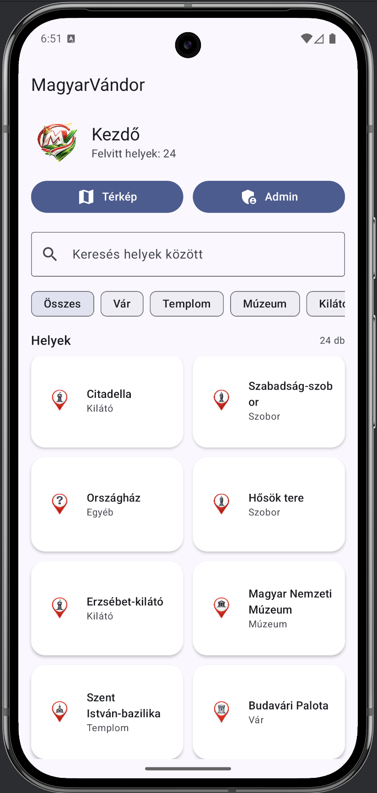
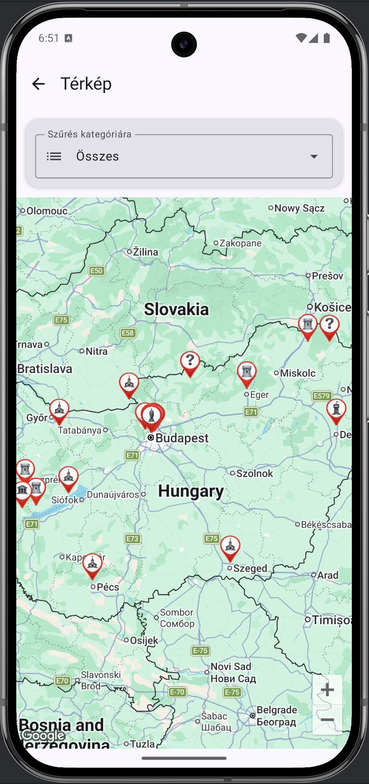
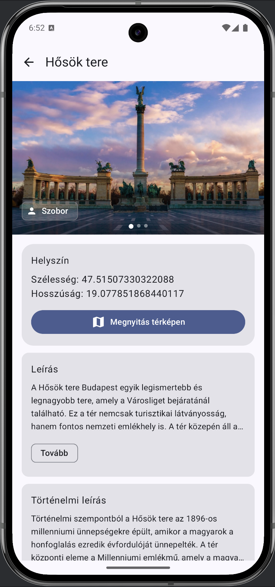
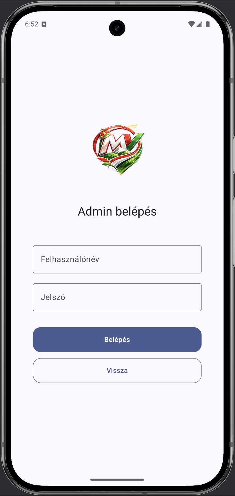
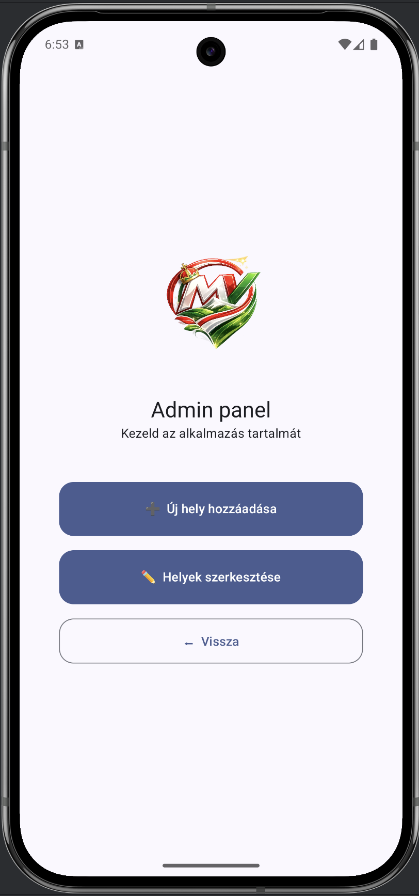
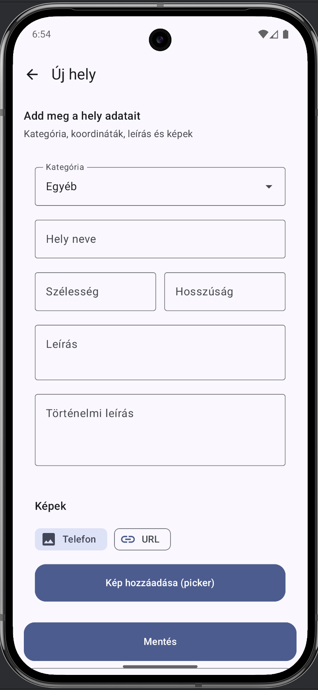
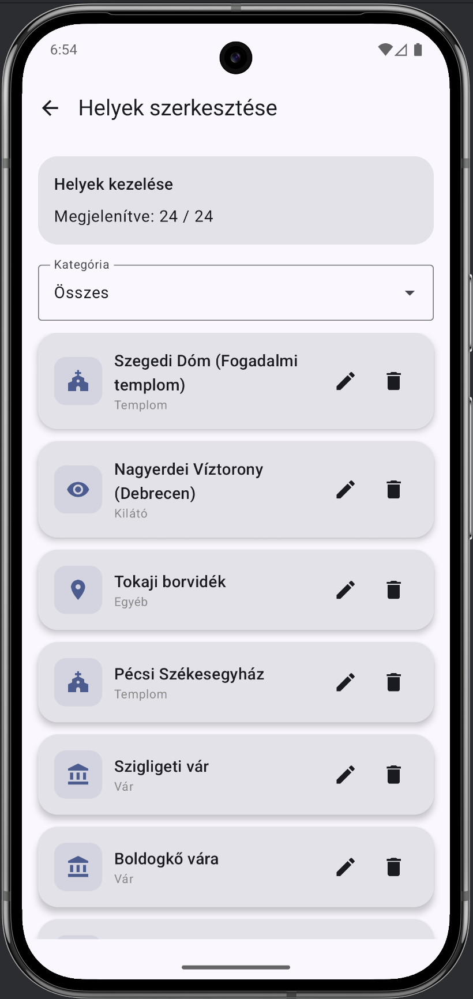
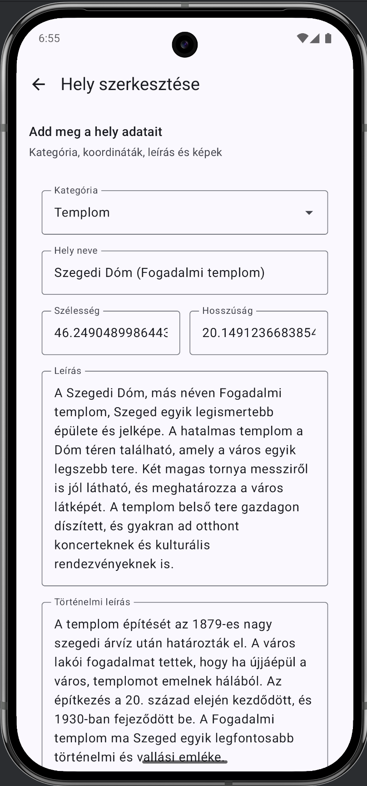

# MagyarVándor

## Házi feladat specifikáció

## Androidalapú szoftverfejlesztés

### 2026. tavaszi félév

### Antal Csongor - (J69X80)

### antalcsongor18@gmail.com

### Laborvezető: Gazdi László

---

## Bemutatás

A MagyarVándor alkalmazás ötlete egy kirándulás során született, amikor a februári szünetben Prágában jártunk. A város tele volt történelmi épületekkel és nevezetességekkel, és sokszor szerettem volna megtudni, pontosan mit látok, milyen története van az adott helynek. Ehhez azonban minden alkalommal külön rá kellett keresni az interneten, ami időigényes és kényelmetlen volt.

Az alkalmazás célja ennek a folyamatnak a leegyszerűsítése. A felhasználó térképen böngészheti a látnivalókat, és egy kattintással megtekintheti a hozzájuk tartozó információkat, leírást és történelmi hátteret. Így nincs szükség több külön alkalmazás használatára.

Jelenleg az alkalmazás magyarországi helyekre fókuszál, magyar nyelven. A későbbiekben bővíthető lenne más országokra és több nyelvre is. A célközönség turisták, diákok és minden érdeklődő.

---

## Főbb funkciók

- A felhasználó listában böngészheti a helyeket
- Kereshet név vagy leírás alapján
- Kategória szerint szűrhet (pl. vár, templom, múzeum)
- A helyek térképen is megjelennek marker formájában
- Egy hely részletes adatai külön képernyőn megtekinthetők
- A részletes nézet tartalmaz leírást, történelmi információt és képeket
- Több kép is tartozhat egy helyhez
- Admin felületen új hely hozható létre, szerkeszthető vagy törölhető

---

## Választott technológiák

- **Kotlin** – az alkalmazás fő programozási nyelve
- **Jetpack Compose** – modern UI megvalósítás
- **MVVM architektúra** – a kód strukturált felépítéséhez
- **Hilt (Dependency Injection)** – függőségek kezelése
- **Firebase Firestore** – felhő alapú adatbázis a helyek tárolására
- **Firebase Storage** – képek feltöltése és tárolása
- **Google Maps Compose** – térképes megjelenítés
- **StateFlow** – reaktív állapotkezelés

---

# Házi feladat dokumentáció

### MagyarVándor

## Bemutatás

A MagyarVándor egy olyan Android alkalmazás, amely lehetővé teszi magyarországi látnivalók böngészését listában és térképen. A felhasználó egy helyre kattintva részletes információkat kap, beleértve a leírást, történelmi hátteret és képeket.

Az alkalmazás célja, hogy egyetlen felületen biztosítson minden fontos információt, amit egy turista egy adott helyről tudni szeretne. Így nem szükséges külön böngészni vagy több alkalmazást használni.

---

## Főbb funkciók

### Kezdőképernyő

- Helyek listázása kártyás nézetben
- Keresés név és leírás alapján
- Kategória szerinti szűrés
- Helyek számának megjelenítése

### Térkép

- Google Maps alapú megjelenítés
- Marker ikonok kategória szerint
- Kattintásra részletek megnyitása
- Kamera fókusz adott helyre

### Részletek képernyő

- Képgaléria (több kép)
- Kategória megjelenítése
- Leírás és történelmi szöveg
- Navigáció térképre

### Admin felület

- Bejelentkezés
- Új hely létrehozása
- Szerkesztés
- Törlés

---

## Felhasználói kézikönyv

Az alkalmazás indítása után a felhasználó a kezdőképernyőre jut. Ez a képernyő szolgál a helyek böngészésére és az alkalmazás fő funkcióinak elérésére.

---

### Kezdőképernyő

A kezdőképernyő felső részén látható az alkalmazás neve és egy rövid információ a felvitt helyek számáról. Ez alatt található két gomb: a térkép megnyitása és az admin felület elérése.

A keresőmező segítségével a felhasználó rá tud keresni egy adott helyre név vagy leírás alapján. A keresés valós időben történik, tehát a lista automatikusan frissül.

A kereső alatt kategória alapú szűrő található, ahol például várak, templomok vagy múzeumok közül lehet választani. A kiválasztott kategória alapján a lista azonnal szűrésre kerül.

A képernyő alsó részén a helyek kártyás (grid) nézetben jelennek meg. Minden kártya tartalmazza a hely nevét és kategóriáját. A kártyára kattintva megnyílik a részletek képernyő.

**1. ábra: A kezdőképernyő, ahol a felhasználó böngészheti a helyeket, kereshet és szűrhet kategória alapján.**

---

### Térkép nézet

A térkép képernyőn a felhasználó Google Maps alapú térképen láthatja a helyeket. A helyek marker formájában jelennek meg, és különböző ikonok jelölik őket a kategóriájuk alapján.

A térkép felett található egy szűrő, amellyel kategória szerint lehet szűkíteni a megjelenített helyeket. Ez segíti a felhasználót abban, hogy csak az őt érdeklő típusú helyeket lássa.

Ha a felhasználó rákattint egy markerre, akkor megnyílik a kiválasztott hely részletek képernyője.

A térkép képes egy adott helyre fókuszálni is, például ha a felhasználó a részletek képernyőről navigál ide.

**2. ábra: A térkép nézet, ahol a helyek markerként jelennek meg és kiválaszthatók.**

---

### Részletek képernyő

A részletek képernyőn a kiválasztott hely minden fontos információja megjelenik.

A felső részen egy lapozható képgaléria található, amely több képet is meg tud jeleníteni az adott helyről. Ha nincs több kép, akkor egy egyszerűbb nézet jelenik meg.

Ez alatt látható a hely kategóriája és alap információi, például a koordináták.

A „Megnyitás térképen” gomb segítségével a felhasználó visszanavigálhat a térkép nézetbe úgy, hogy a térkép automatikusan az adott helyre fókuszál.

A leírás és a történelmi leírás külön kártyákban jelenik meg. Ezek a szövegek lenyithatók („Tovább” gomb), így hosszabb szövegek is jól kezelhetők.

**3. ábra: A részletek képernyő, ahol a hely teljes információja megtekinthető.**

---

### Admin felület

Az admin felület csak bejelentkezés után érhető el. A belépéshez egy előre megadott felhasználónév és jelszó szükséges.

Az admin panelen két fő funkció érhető el:

- új hely hozzáadása
- meglévő helyek szerkesztése

A szerkesztés menüpontban listában jelennek meg a helyek, ahol lehetőség van módosításra vagy törlésre.

**4. ábra: Az admin belépés, ahol meg kell adni a felhasználónevet és a jelszót.**

**5. ábra: Az admin felület, ahol a helyek kezelhetők.**

---

### Hely létrehozása és szerkesztése

Az admin egy űrlap segítségével hozhat létre új helyet vagy szerkeszthet meglévőt.

Az űrlapon megadható:

- a hely neve
- kategória kiválasztása
- koordináták (szélesség és hosszúság)
- leírás
- történelmi leírás

A felhasználó több képet is hozzáadhat:

- telefonról kiválasztva
- vagy URL megadásával

**6. ábra: Új hely létrehozása**

**7. ábra: Helyek szerkesztése**

**8. ábra: Egy adott hely szerkesztésének képernyője**

A mentés gombbal az adatok elmentésre kerülnek az adatbázisba, és azonnal megjelennek az alkalmazásban.

---

### Összegzés

Az alkalmazás célja, hogy egyszerű és gyors módon biztosítson információt a különböző látnivalókról. A felhasználó könnyen navigálhat a listás és térképes nézet között, és részletes információkat kap minden helyről. Az admin funkciók lehetővé teszik az alkalmazás tartalmának folyamatos bővítését.

---

## Felhasznált technológiák

- **Jetpack Compose** – Az alkalmazás teljes felhasználói felületét Compose-ban valósítottam meg. Minden képernyő (kezdőképernyő, térkép, részletek, admin felület) külön composable függvényként készült, és több kisebb komponensre bontottam (pl. CategoryFilter, PlaceCard). Ez segített abban, hogy a UI átláthatóbb és könnyebben újrafelhasználható legyen.

- **MVVM architektúra** – Az alkalmazásban minden képernyőhöz tartozik egy ViewModel, amely kezeli az állapotot és a logikát. Például a HomeViewModel a helyek listáját kezeli, a PlaceFormViewModel az űrlap adatokat, a PlaceDetailsViewModel pedig a részleteket és a képeket tölti be. Így a UI és az üzleti logika jól el van választva.

- **Hilt (Dependency Injection)** – A Hilt segítségével adtam át a repository-t a ViewModel-eknek. Így nem kellett manuálisan példányosítani az osztályokat, és egyszerűbb lett a kód. A ViewModel-ek automatikusan megkapják a szükséges adatforrást.

- **Firebase Firestore** – Az alkalmazás adatait Firestore adatbázisban tárolom. A helyek egy kollekcióban jelennek meg, és minden dokumentum egy adott helyet reprezentál. A dokumentum tartalmazza az alap adatokat és a képek listáját is. A Firestore valós idejű frissítést biztosít, így az adatok azonnal megjelennek az alkalmazásban.

- **Firebase Storage** – A képek feltöltése Firebase Storage segítségével történik. A telefonról kiválasztott képek feltöltésre kerülnek a felhőbe, és az alkalmazás a letöltési URL-t tárolja az adatbázisban.

- **Google Maps Compose** – A térkép megjelenítését Google Maps Compose segítségével oldottam meg. A helyek marker formájában jelennek meg, és kategória alapján külön ikonokat kapnak. A térkép képes egy adott helyre fókuszálni.

- **StateFlow** – Az állapotkezelést StateFlow segítségével oldottam meg. A repository folyamatosan szolgáltatja az adatokat, a ViewModel-ek ezt továbbítják a UI felé, és a felület automatikusan frissül.

## Fontosabb technológiai megoldások

Az alkalmazás egyik legfontosabb része a több kép kezelése volt. Egy helyhez több kép is tartozhat, amelyek egy listában kerülnek tárolásra az adatbázisban. A telefonról kiválasztott képek feltöltésre kerülnek Firebase Storage-be, majd a letöltési URL-ek kerülnek eltárolásra.

A térképes megjelenítés során kategória alapú ikonokat használok.

Az admin jogosultság kezelése egy egyszerű session alapú megoldással történik, amely `StateFlow`-t használ az állapot kezelésére.

Az alkalmazás teljes felhasználói felülete Jetpack Compose segítségével készült, és több kisebb komponensre lett bontva.

---
