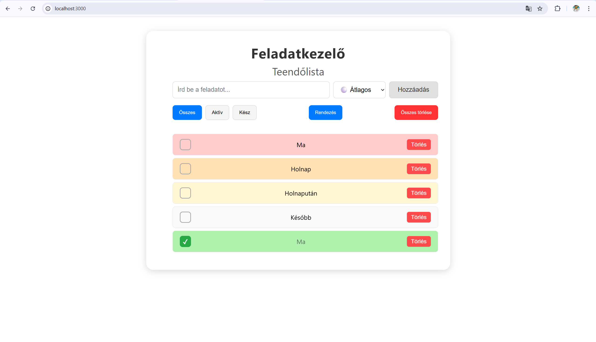

# Feladatkezelő – React alapú feladatkezelő alkalmazás

A Feladatkezelő egy modern, könnyen használható  alkalmazás, amely React segítségével készült.  
Lehetővé teszi a feladatok rögzítését, jelölését, fontossági szint szerinti rendezését, szűrését és szerkesztését.  
A felhasználói felület letisztult, reszponzív, és minden adat automatikusan mentésre kerül a böngészőben (localStorage).

---

## ⭐ Fő funkciók

- **Új feladat hozzáadása**
- **Fontossági szint választása**  
  (Átlagos, Nem fontos, Fontos, Nagyon fontos)
- **Feladat szerkesztése** (dupla kattintással)
- **Feladat állapotának váltása** (pipálás)
- **Feladatok törlése**
- **Összes feladat eltávolítása**
- **Szűrés:** Összes / Aktív / Kész
- **Rendezés fontosság szerint**
- **Adatok automatikus mentése** localStorage-be
- **Reszponzív, igényes felhasználói felület**

---

## 🛠 Felhasznált technológiák

- **React**
- **TypeScript**
- **CSS modulok**
- **LocalStorage API**
- **React Hooks (useState, useEffect, useRef)**

---

## 📁 Projekt indítása

A projekt mappájában futtasd:

```bash
npm install
npm start


A fejlesztői szerver elindul a következő címen:  
👉 http://localhost:3000

A változtatásokat automatikusan újratölti.

---

## **Mappa struktúra**

src/
├── components/
│ ├── AddTaskForm.tsx
│ ├── Filter.tsx
│ ├── Header.tsx
│ ├── TaskItem.tsx
│ └── TaskList.tsx
│
├── styles/
│ ├── App.css
│ ├── AddTaskForm.css
│ ├── Filter.css
│ ├── Header.css
│ ├── TaskItem.css
│ └── TaskList.css
│
├── utils/
│ └── storage.ts
│
├── App.tsx
├── index.css
├── index.tsx
└── types.ts


---

## **Tárolás (localStorage)**

A feladatok minden módosítás után elmentődnek a böngészőben.  
A következő indításnál ugyanonnan folytatható a lista.

---

## **Fejlesztői megjegyzések**

- A kódot megpróbáltam jól strukturálni, minden komponens külön fájlban található.  
- A fontosabb funkciók rövid, tiszta kommentekkel vannak ellátva.  
- A UI átlátható, reszponzív és ergonomikus.  
- A felhasználói élményt háttérszínek és rendezési lehetőség javítják.

---

## **Képernyőkép**


---

## **Összegzés**

A Feladatkezelő egy modern, könnyen használható React alkalmazás,  
amely a mindennapi feladatkezelést támogatja.  
